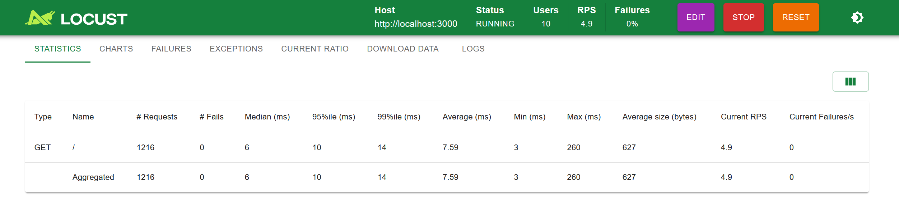
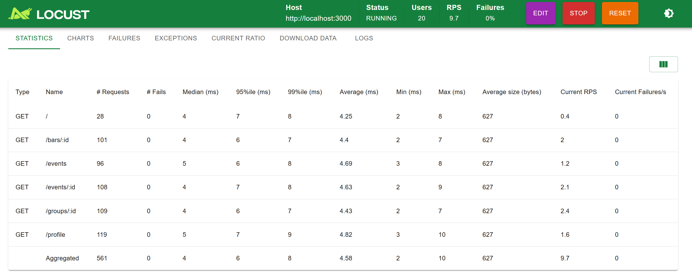
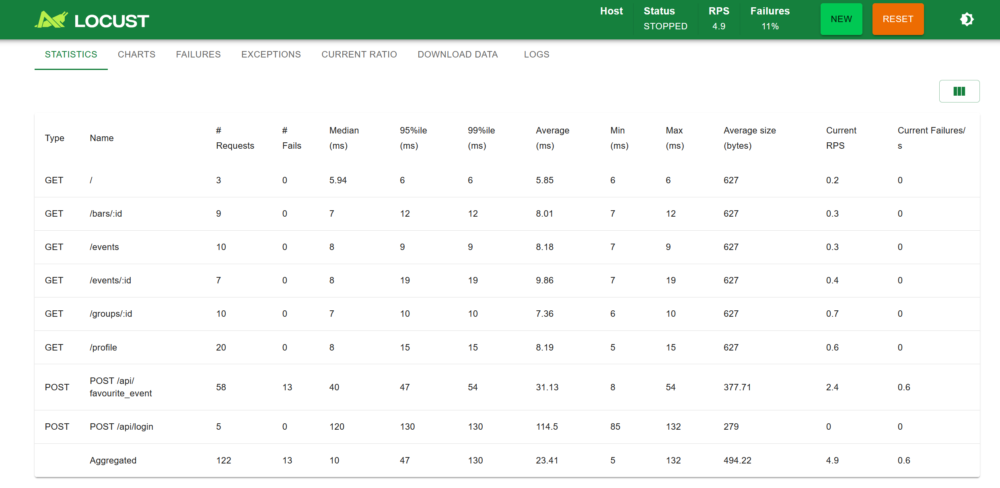
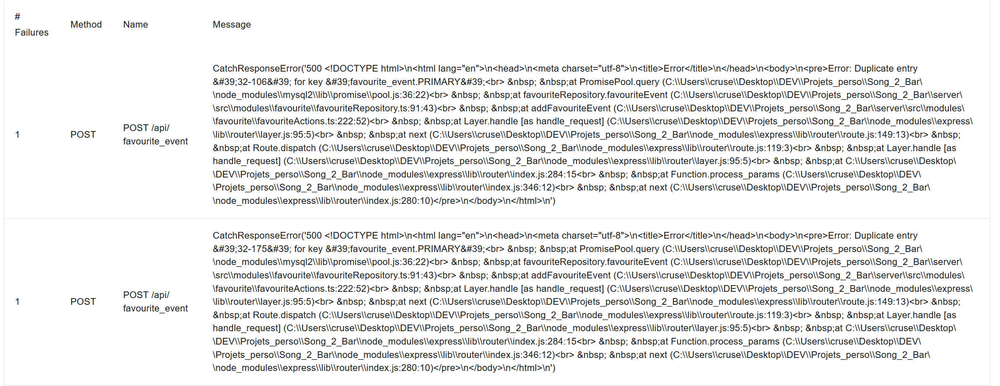

# Atelier 3 : Test de charge

## Installation

## Tests de charge du projet web

### Tests sur les pages publiques
Les tests de charge effectués sur les différentes pages de l'application (/, /events, /events/:id, /groups/:id, /bars/:id, /profile) n’ont retourné aucune erreur.
- Aucun code HTTP 4xx ou 5xx observé
- Temps de réponse stables
- Aucun pic d’erreur sous montée en charge

Ces résultats indiquent que les routes de consultation sont stables sous charge modérée.

### Test sur POST /api/login et sur POST /api/favourite_event
Le test de charge sur la route d’authentification (POST /api/login) n’a retourné aucune erreur.
- Authentification stable
- Génération du token JWT correcte
- Aucun 401/422 inattendu
- Pas d’erreurs 500

Cela indique que la vérification du mot de passe (argon2), la génération du JWT et l’accès base de données fonctionnent correctement sous charge.

Le test de charge sur POST /api/favourite_event a généré des erreurs 500.

Les erreurs correspondent à :
Duplicate entry 'userId-eventId' for key 'favourite_event.PRIMARY'

#### Analyse :
La table favourite_event possède une clé primaire composite (user_id, event_id).
Lorsque la requête tente d’insérer un favori déjà existant, la base de données lève une erreur SQL.
Cette erreur n’est pas interceptée côté backend, ce qui provoque :
- une exception non gérée
- un retour HTTP 500

#### Known Issue :
L’endpoint POST /api/favourite_event n’est pas idempotent.

Il devrait :
- soit retourner 409 Conflict si le favori existe déjà
- soit être rendu idempotent (200 OK si déjà existant)
- soit utiliser INSERT IGNORE ou ON DUPLICATE KEY

#### Amélioration recommandée :
Modifier la logique backend pour gérer les doublons proprement afin d’éviter les erreurs 500 en charge.

## Membres

Edouard Dieppois
Nicolas Chiche
Thomas Crusel