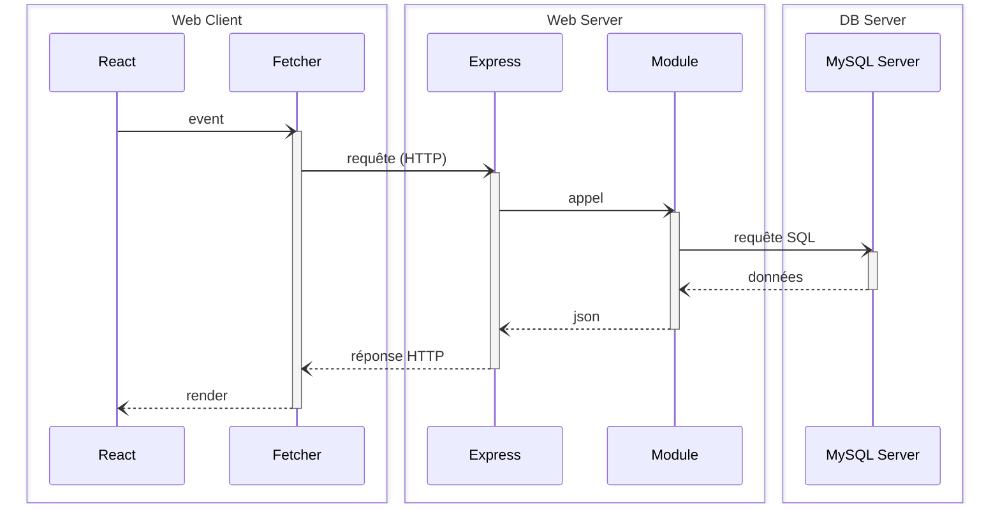

# Song2Bar

Song2Bar est une application web permettant de découvrir des bars proposant des concerts, de consulter les évènements musicaux à venir, de suivre des groupes de musique et de participer aux évènements qui vous intéressent.

Le projet est un monorepo JS/TypeScript suivant l'architecture React-Express-MySQL :



L'application est en production à l'adresse [https://www.song2bar.fr](https://www.song2bar.fr).

Principaux outils utilisés :

- **Vite** : build tool et serveur de dev pour le client React.
- **Express** : serveur HTTP côté API.
- **MySQL** (via `mysql2`) : persistance des données.
- **Concurrently** : exécution simultanée du client et du serveur en développement.
- **Biome** : lint et formatage du code (remplace ESLint/Prettier).
- **Jest / Supertest** : tests unitaires et d'intégration côté serveur.
- **argon2 / jsonwebtoken** : hash des mots de passe et authentification par JWT.
- **Docker / GitHub Actions** : build, publication et déploiement continu (voir [Déploiement](#déploiement-continu)).

## Table des Matières

- [Song2Bar](#song2bar)
  - [Table des Matières](#table-des-matières)
  - [Installation \& Utilisation](#installation--utilisation)
  - [Les choses à retenir](#les-choses-à-retenir)
    - [Commandes de Base](#commandes-de-base)
    - [Structure des Dossiers](#structure-des-dossiers)
    - [Mettre en place la base de données](#mettre-en-place-la-base-de-données)
    - [Développer la partie back-end](#développer-la-partie-back-end)
    - [Autres Bonnes Pratiques](#autres-bonnes-pratiques)
  - [FAQ](#faq)
    - [Installation avec Docker (développement)](#installation-avec-docker-développement)
    - [Accéder à la base de données](#accéder-à-la-base-de-données)
    - [Déploiement continu](#déploiement-continu)
      - [Pipeline GitHub Actions](#pipeline-github-actions)
      - [Secrets et variables requis](#secrets-et-variables-requis)
      - [Infrastructure côté VPS](#infrastructure-côté-vps)
      - [Déploiement manuel / hotfix](#déploiement-manuel--hotfix)
    - [Variables d'environnement](#variables-denvironnement)
    - [Logs](#logs)

## Installation & Utilisation

1. Installez le plugin **Biome** dans VSCode et configurez-le.
2. Clonez ce dépôt, puis accédez au répertoire cloné.
3. Exécutez la commande `npm install`.
4. Créez des fichiers d'environnement (`.env.development`) dans les répertoires `server` et `client` en copiant les fichiers `.env.sample` comme modèles (**ne les supprimez pas**), puis renseignez vos propres valeurs locales.
5. Mettez en place la base de données (voir [Mettre en place la base de données](#mettre-en-place-la-base-de-données)).
6. Lancez `npm run dev` pour démarrer le client (Vite) et le serveur (Express) en parallèle.

## Les choses à retenir

### Commandes de Base

| Commande               | Description                                                                 |
|------------------------|-----------------------------------------------------------------------------|
| `npm install`          | Installe les dépendances pour le client et le serveur                       |
| `npm run db:migrate`   | Recrée la base de données à partir de `server/database/schema.sql`          |
| `npm run db:seed`      | Peuple la base de données avec les fixtures (`server/database/fixtures`)    |
| `npm run dev`          | Démarre le client et le serveur en parallèle (Concurrently)                 |
| `npm run build`        | Build le client (Vite) et exécute la migration côté serveur                 |
| `npm run check`        | Exécute les outils de validation (linting et formatage Biome + types)       |
| `npm run test`         | Exécute les tests unitaires et d'intégration (Jest/Supertest)               |

### Structure des Dossiers

```plaintext
Song_2_Bar/
│
├── server/
│   ├── src/
│   │   ├── modules/
│   │   │   ├── bar/
│   │   │   ├── event/
│   │   │   ├── favourite/
│   │   │   ├── groups/
│   │   │   ├── participate/
│   │   │   ├── user/
│   │   │   └── authActions.ts
│   │   ├── types/
│   │   ├── app.ts
│   │   ├── main.ts
│   │   └── router.ts
│   ├── bin/
│   │   ├── migrate.ts
│   │   └── seed.ts
│   ├── database/
│   │   ├── client.ts
│   │   ├── checkConnection.ts
│   │   ├── fixtures/
│   │   └── schema.sql
│   ├── tests/
│   ├── .env.sample
│   ├── .env.development
│   └── .env.production
│
└── client/
    ├── src/
    │   ├── components/      # BarCard, EventCard, GroupCard, LikeButton, Header, ...
    │   ├── pages/            # Home, BarPage, Event, MusicGroup, Login, Register, UserProfile
    │   ├── contexts/
    │   ├── services/
    │   ├── router.tsx
    │   └── App.tsx
    ├── .env.sample
    ├── .env.development
    └── .env.production
```

### Mettre en place la base de données

**Créer et remplir le fichier `.env.development`** dans le dossier `server` (voir `server/.env.sample`) :

```plaintext
NODE_ENV=development
APP_PORT=3310
APP_SECRET=YOUR_APP_SECRET_KEY

DB_HOST=localhost
DB_PORT=3306
DB_USER=YOUR_DATABASE_USERNAME
DB_PASSWORD=YOUR_DATABASE_PASSWORD
DB_NAME=song2bar

CLIENT_URL=http://localhost:3000
```

Côté client, `client/.env.development` doit pointer vers l'API locale :

```plaintext
VITE_API_URL_DEV=http://localhost:3310
```

**Synchroniser la BDD avec le schéma** (`server/database/schema.sql`) et charger les fixtures :

```sh
npm run db:migrate
npm run db:seed
```

### Développer la partie back-end

L'API suit une organisation par module (`server/src/modules/<nom>`), chacun exposant généralement un fichier `Actions` (contrôleurs Express) et un `Repository` (accès aux données), à l'image des modules `bar`, `event`, `groups`, `favourite`, `participate` et `user` déjà en place :

```typescript
// server/src/modules/bar/barActions.ts
const browse: RequestHandler = async (req, res, next) => {
  try {
    const bars = await barRepository.readAll();
    res.json(bars);
  } catch (err) {
    next(err);
  }
};
```

```typescript
// server/src/modules/bar/barRepository.ts
class BarRepository {
  async readAll() {
    const [rows] = await databaseClient.query<Rows>("select * from bar");
    return rows as Bar[];
  }
}
```

Les routes correspondantes sont déclarées dans `server/src/router.ts`, et l'authentification (JWT + argon2) est gérée via `authActions.ts` et les middlewares associés.

### Autres Bonnes Pratiques

- **Sécurité** :
  - Validez et échappez toujours les entrées des utilisateurs.
  - Utilisez HTTPS pour toutes les communications réseau.
  - Stockez les mots de passe de manière sécurisée en utilisant des hash forts (argon2, déjà en place).
  - Ne committez jamais de secrets (`.env*`, mots de passe, clés) — utilisez les fichiers `.env.sample` comme modèles et gardez les vraies valeurs hors du dépôt.
  - Revoyez et mettez à jour régulièrement les dépendances.

- **Code** :
  - Suivez les principes SOLID pour une architecture de code propre et maintenable.
  - Utilisez TypeScript pour bénéficier de la vérification statique des types.
  - Adoptez un style de codage cohérent avec Biome (`npm run check`).
  - Écrivez des tests pour toutes les fonctionnalités critiques.

## FAQ

### Installation avec Docker (développement)

> ⚠️ Prérequis : Vous devez avoir installé Docker et Docker Compose sur votre machine.
> Suivez les instructions ici : [Docker Installation](https://docs.docker.com/get-docker/).

Le `docker-compose.yml` à la racine du projet est utilisé aussi bien en local qu'en production : il démarre un conteneur `web` (client + API, image `ghcr.io/tcrusel/song_2_bar`) et un conteneur `database` (MySQL 8.0).

Pour lancer les conteneurs en local :

```bash
docker compose up -d --build
```

L'API sera accessible sur `http://localhost:3310` et le client sur `http://localhost:3000`. Pour arrêter et supprimer les conteneurs :

```bash
docker compose down
```

Les dépendances (`node_modules`) sont installées à l'intérieur du conteneur. Si vous utilisez un IDE comme VSCode et souhaitez éditer les fichiers du projet sans erreurs de modules manquants, installez-les aussi en local avec `npm install`.

### Accéder à la base de données

Pour vous connecter à la base de données MySQL du conteneur `database` :

```bash
docker compose exec database sh -c "mysql -u$MYSQL_USER -p$MYSQL_PASSWORD song2bar"
```

### Déploiement continu

> Le projet n'utilise plus Traefik ni le [VPS Traefik Starter Kit](https://github.com/WildCodeSchool/vps-traefik-starter-kit/) de la Wild Code School. Le déploiement est entièrement automatisé via **GitHub Actions**, une image Docker publiée sur **GHCR** (GitHub Container Registry) et un déploiement par SSH sur un VPS.

#### Pipeline GitHub Actions

Le workflow [`.github/workflows/main.yml`](.github/workflows/main.yml) se déclenche à chaque push sur `main` et enchaîne 4 jobs :

1. **`scan`** — analyse le dépôt avec [Gitleaks](https://github.com/gitleaks/gitleaks) pour détecter d'éventuels secrets committés.
2. **`build`** — build l'image Docker (`Dockerfile`, multi-plateforme `linux/amd64` et `linux/arm64` via Buildx) et la publie sur `ghcr.io/tcrusel/song_2_bar` avec les tags `main`, `latest` et le SHA du commit.
3. **`deploy`** — copie le `docker-compose.yml` sur le VPS de production (via `scp`), puis se connecte en SSH pour exécuter :
   ```bash
   docker compose -f docker-compose.yml pull
   docker compose -f docker-compose.yml up -d --remove-orphans
   ```
4. **`cleanup`** — supprime les anciennes versions de l'image sur GHCR (ne garde que les 3 dernières versions taguées, en plus de `latest`/`main`).

#### Secrets et variables requis

À configurer dans `Settings → Secrets and variables → Actions` du dépôt GitHub :

| Nom              | Description                                          |
|-------------------|-------------------------------------------------------|
| `PROD_SSH_HOST`     | Adresse IP / hostname du VPS de production            |
| `PROD_SSH_USERNAME` | Utilisateur SSH pour se connecter au VPS               |
| `PROD_SSH_KEY`      | Clé privée SSH pour l'authentification                |
| `PROD_SSH_PORT`     | Port SSH du VPS                                        |

`GITHUB_TOKEN` (fourni automatiquement par GitHub Actions) est utilisé pour publier l'image sur GHCR.

#### Infrastructure côté VPS

Sur le VPS, le projet vit dans `~/projects/Song_2_Bar/` avec un fichier `docker-compose.yml` (déployé automatiquement) et un fichier `.secrets.env` (créé et maintenu **manuellement** sur le serveur, jamais commité) contenant au minimum :

```plaintext
DB_PASSWORD=...
MYSQL_ROOT_PASSWORD=...
MYSQL_PASSWORD=...
APP_SECRET=...
```

Les conteneurs `web` (ports `3310` et `3000`) et `database` (port `3308`) sont exposés uniquement sur `127.0.0.1` : c'est un reverse proxy externe (non versionné dans ce dépôt) qui termine le TLS et route `https://www.song2bar.fr` vers ces ports locaux.

#### Déploiement manuel / hotfix

En cas de besoin, un déploiement peut être rejoué à la main depuis le VPS :

```bash
cd projects/Song_2_Bar
docker compose pull
docker compose up -d --remove-orphans
```

### Variables d'environnement

Chaque `.env.sample` (`server/.env.sample`, `client/.env.sample`) documente les variables attendues. En résumé :

**Serveur** (`server/.env.*`) : `NODE_ENV`, `APP_PORT`, `APP_SECRET`, `DB_HOST`, `DB_PORT`, `DB_USER`, `DB_PASSWORD`, `DB_NAME`, `CLIENT_URL`.

**Client** (`client/.env.*`) : `VITE_API_URL_DEV` (développement) / `VITE_API_URL_PROD` (production), utilisées via `import.meta.env`.

> ⚠️ Les fichiers `.env.development` et `.env.production` ne doivent contenir que des valeurs locales/factices dans le dépôt public. Les vraies valeurs de production (mots de passe, secrets) doivent être injectées uniquement via le `.secrets.env` du VPS, jamais committées.

### Logs

Pour accéder aux logs du projet en production, connectez-vous au VPS (`ssh user@host`), placez-vous dans `projects/Song_2_Bar/` puis exécutez :

```bash
docker compose logs -t -f
```
